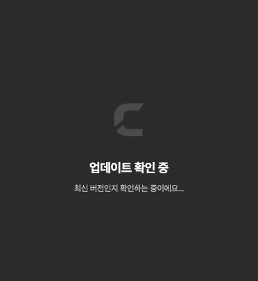
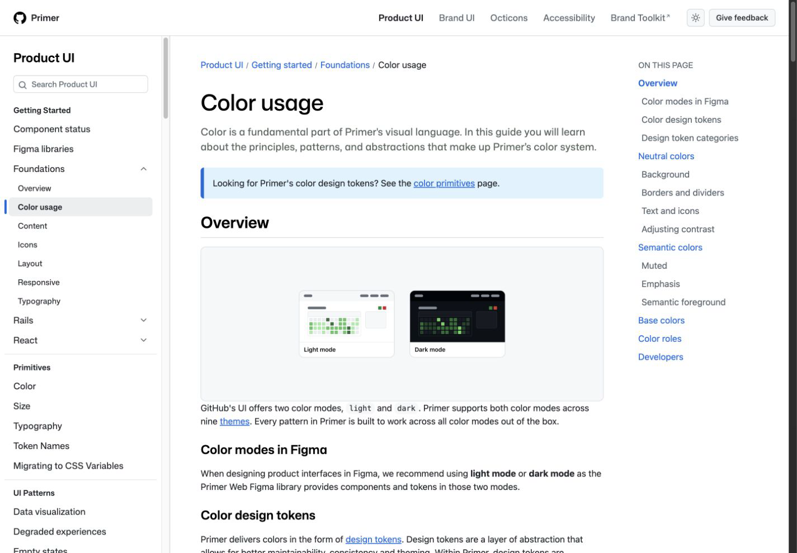
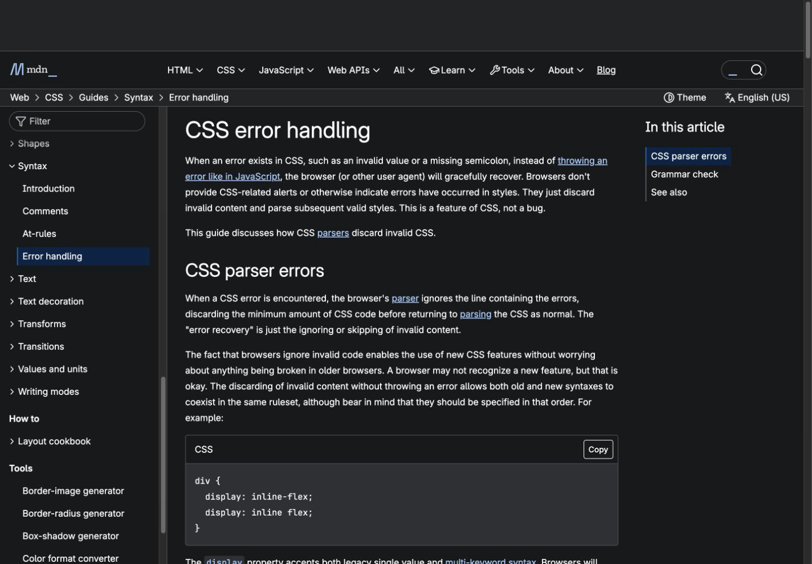
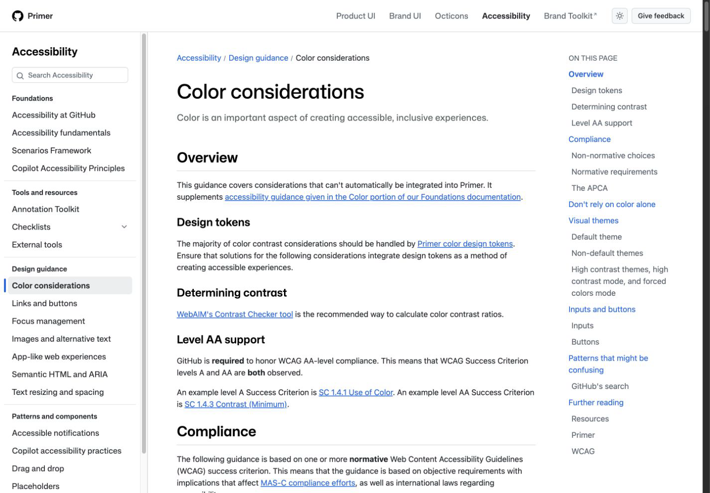

# Design Improvement: Mac UI CSS consistency

## TL;DR

화면을 새로 디자인하기보다, 이미 존재하는 semantic theme token을 실제 컴포넌트와 Chart.js 설정까지 일관되게 적용하는 것이 가장 큰 개선점입니다. 브라우저가 무시하는 CSS 값과 서로 덮어쓰는 선언을 제거하고, light/dark mode에서 같은 정보 위계와 대비가 유지되도록 정리합니다.

> Lazyweb MCP는 현재 환경에 노출되지 않아, 이 보고서는 현재 로컬 화면과 공식 Primer·MDN 자료를 기반으로 작성했습니다.

## Current State



_Clash의 macOS startup window. 절제된 dark surface와 단순한 위계는 유지하되, 같은 token 원칙을 검색 입력·차트·상점·로드맵 화면까지 확장할 필요가 있습니다._

## Improvement Ideas

### 1. Semantic token을 모든 시각 계층의 단일 기준으로 사용하기 ⭐

`theme.label`, `theme.line`, `theme.fill`, `theme.background`을 텍스트·경계·surface 역할에 맞춰 사용하고, 상호작용과 상태에는 `action`, `content`, `badge`, `interaction`, `feedback`, `dataVisualization` token을 분리합니다. SearchInput의 고정 밝은 글자색과 Chart.js의 고정 dark palette를 theme 값으로 바꾸면 light/dark mode 모두에서 같은 위계를 유지할 수 있습니다.

**Inspired by:**


_GitHub Primer — base color가 아니라 역할 기반 token으로 light/dark mode를 전환하는 구조 [Web]. [원문](https://primer.style/product/getting-started/foundations/color-usage/)_

**Why this works:** 색상 값이 아니라 `label`, `line`, `background` 역할을 코드에 남겨서 테마가 바뀌어도 컴포넌트 의미와 대비가 유지됩니다.

**Sketch:**

```text
raw palette ──> semantic theme ───────> component
 blue[40]       label.normal            SearchInput text
 red[40]        action.primary          CTA surface
 red[40]        interaction.selectionBorder selected border
 green[20]      feedback.success        status text
 neutral[30]    dataVisualization.series Chart line
```

### 2. 브라우저가 무시하는 값과 중복 선언 제거하기

`backgroundColor: "none"`은 `transparent`로 바꾸고, Figma tracking 의도인 `-2%`는 호환성이 명확한 `-0.02em`으로 표현합니다. 동일 block에서 앞 선언을 즉시 덮어쓰는 `background-color`와 상충하는 width/flex-basis도 하나의 값으로 통합합니다.

**Inspired by:**


_MDN — 잘못된 CSS 값은 오류를 표시하지 않고 해당 선언만 버려지므로 정적 코드에서 제거해야 합니다 [Web]. [원문](https://developer.mozilla.org/en-US/docs/Web/CSS/Guides/Syntax/Error_handling)_

**Why this works:** 브라우저별 fallback 차이를 없애고, DevTools에서 실제 적용값과 소스가 일치해 유지보수가 쉬워집니다.

**Sketch:**

```text
before                           after
width: 32rem
min-width: 23rem        ──>       flex: 0 0 23rem
flex: 0 0 23rem

background-color: line.neutral   background-color: line.neutral
background-color: conditional    (single source)
```

### 3. Light/dark mode에서 같은 최소 대비 유지하기

검색어·placeholder·chart tick·tooltip은 각각 normal/assistive/background/line token을 사용합니다. light surface 위에 밝은 고정색이 올라가는 조합을 제거하고, 상태 표현은 색 하나가 아니라 텍스트 위계와 경계도 함께 사용합니다.

**Inspired by:**


_GitHub Primer Accessibility — contrast를 개별 hex가 아니라 design token과 theme 수준에서 관리하는 접근 [Web]. [원문](https://primer.style/accessibility/design-guidance/color-considerations/)_

**Why this works:** 한 테마에서만 우연히 읽히는 색 조합을 줄이고, 이후 token 값이 조정돼도 모든 소비자가 함께 개선됩니다.

**Sketch:**

```text
┌ Search surface: fill.alternative ┐
│ Query text: label.normal         │
│ Hint text:  label.alternative    │
│ Focus line: primary.normal       │
└──────────────────────────────────┘
```

### 4. Surface와 panel의 geometry를 한 선언으로 결정하기

상점 detail panel, roadmap preview, modal divider처럼 width·basis·background가 여러 선언에 나뉜 곳은 한 역할당 한 선언으로 줄입니다. 고정 크기가 필요한 desktop panel은 하나의 `flex-basis`로 크기를 결정하고 내부만 scroll되도록 유지합니다. 좁은 창에서는 preview를 단일 열로 전환합니다.

**Inspired by:** Primer의 foundations 방식처럼 spacing과 layout을 반복 가능한 primitive로 취급합니다 [Web].

**Why this works:** 창 크기에 따라 panel이 예상과 다르게 수축하거나, 뒤쪽 선언이 앞쪽 스타일을 조용히 덮어쓰는 문제를 없앱니다.

**Sketch:**

```text
┌──────────── flexible list ────────────┬─ 23rem detail ─┐
│ min-width: 0                          │ flex: 0 0 23rem │
│ overflow-y: auto                      │ overflow: auto  │
└───────────────────────────────────────┴─────────────────┘
```

## What's Working

- startup window는 logo, title, description의 위계가 단순하고 명확합니다.
- `label`, `line`, `fill`, `background` semantic token 구조가 이미 있어 대규모 재설계 없이 정리할 수 있습니다.
- 대부분의 styled-component가 rem과 flex/grid를 사용해 desktop window 크기 변화에 대응할 기반이 있습니다.
- dark mode의 기본 background와 neutral surface 구분은 일관된 편입니다.

## All References

- `current.png` — Clash macOS startup window [Local]
- `primer-color.png` — GitHub Primer color usage and token hierarchy [Web]
- `primer-accessibility.png` — GitHub Primer color and contrast guidance [Web]
- `mdn-css-errors.png` — MDN CSS error handling [Web]
